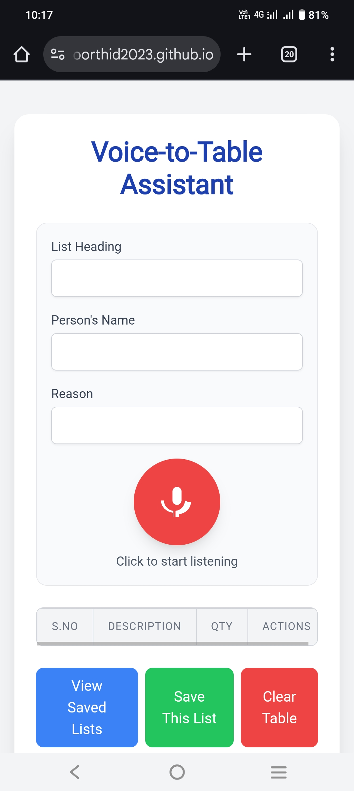
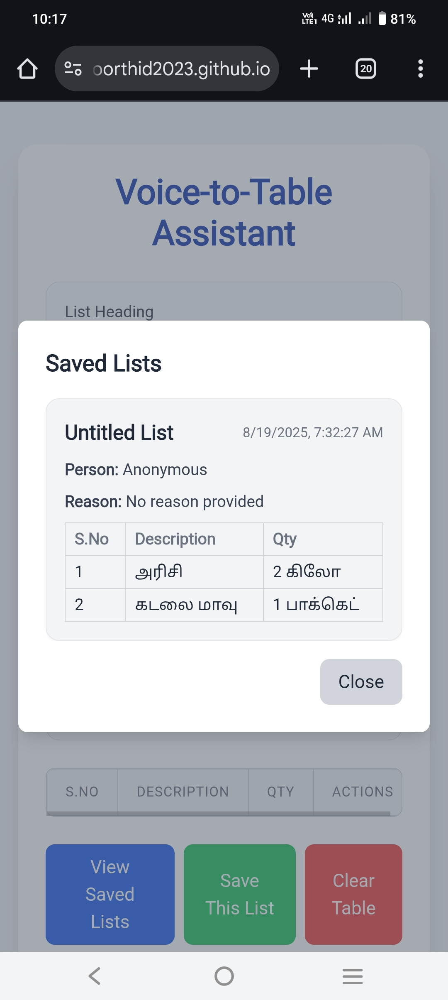
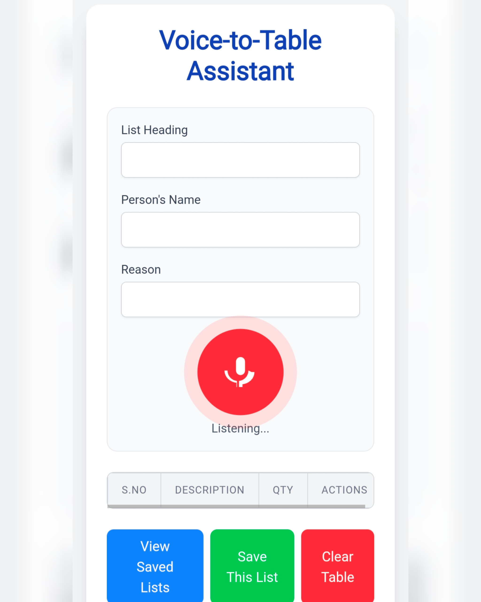

# Voice-to-Table Assistant (Talk2List)

A convenient web app that transforms spoken input into a structured, editable table in real time. It helps users quickly create and save lists using their voice—no typing required.

## 🚀 Live Demo
[Try it here](https://moorthid2023.github.io/Talk2List/)

---

## 📸 Screenshots

### Home Screen


### Saved List


### Listening



---

## ✨ Features
- 🎙️ **Voice-driven data entry** for fast, hands-free list creation  
- 📋 **Real-time table population** (Name, Reason, etc.)  
- 💾 **Save and manage lists** with “Save This List” and “View Saved Lists”  
- 🗑️ **Clear table** option to reset entries  
- ✅ **Modal confirmations** with intuitive "Cancel" and "OK"  

---

## ⚙️ Installation & Setup

1. Clone this repository:
   ```bash
   git clone https://github.com/moorthid2023/Talk2List.git
   cd Talk2List

2. Open index.html directly in your browser, or serve via a local server (e.g., VSCode Live Server).


3. Allow microphone access when prompted.


---

🖥️ Usage

1. Click “Click to start listening”


2. Speak your entries (List heading, Name, Reason, etc.)


3. Review entries as they appear in the table


4. Use Save This List to store, View Saved Lists to manage, or Clear Table to start anew


---

🛠️ Tech Stack

Frontend: HTML, CSS, JavaScript

Speech Recognition: Web Speech API

Data Persistence: Local Storage


---

📂 Project Structure

Talk2List/
├── index.html
├── script.js
├── styles.css
├── screenshots/
│   ├── home.
│   ├── voice-input.png
│   └── saved-lists.png
└── README.md


---

🤝 Contribution

1. Fork the repository


2. Create a feature branch (feature/new-feature)


3. Commit changes (git commit -m 'Add new feature')


4. Push to branch


5. Open a pull request


---

📜 License

MIT License © 2025 Moorthi D

---
